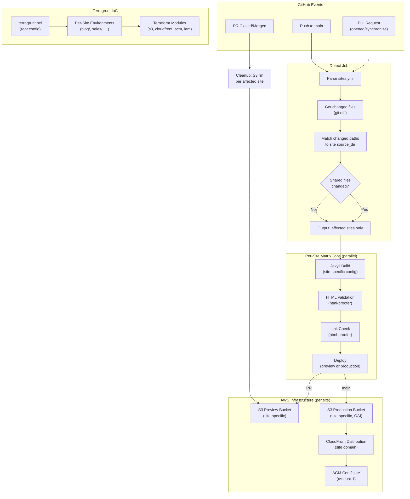

# Design Document: Netlify-Style CI/CD Pipeline (Multi-Site)

## Overview

This design describes a GitHub Actions-based CI/CD pipeline for multiple Jekyll sites (blogs, sales pages) hosted within a single repository, deployed to AWS S3 with CloudFront CDN. AWS infrastructure is provisioned and managed using Terragrunt (wrapping Terraform). The pipeline provides:

- A `sites.yml` Site Registry at the repo root defining all sites and their configuration
- Change Detection that determines which site(s) changed per push/PR
- Automated Jekyll builds for affected sites only
- Quality gates: HTML validation and internal link checking via `html-proofer`
- Per-site preview deployments to dedicated S3 buckets, namespaced by PR number
- Per-site production deployment to S3 with CloudFront cache invalidation on merge to `main`
- Cleanup of preview environments when PRs are closed
- Terragrunt-managed AWS infrastructure with reusable modules parameterized per site

The system uses GitHub Actions dynamic matrix strategy to build/deploy only affected sites in parallel. A "detect" job reads `sites.yml`, compares changed file paths against site source directories, and outputs a JSON matrix consumed by downstream build/deploy jobs. Each site has its own S3 buckets, CloudFront distribution, and IAM-scoped permissions.

### Key Design Decisions

1. **`sites.yml` as the single source of truth** — All site metadata (identifier, source directory, domain, bucket names, CloudFront distribution ID) lives in one file. Workflows read it dynamically, so adding a new site requires no workflow file changes.

2. **Dynamic matrix strategy for multi-site parallelism** — A "detect" job outputs a JSON array of affected sites. Downstream jobs use `fromJSON()` to create a matrix, running build/validate/deploy in parallel per site. If no sites are affected, the matrix is empty and jobs are skipped.

3. **Terragrunt with reusable Terraform modules** — Infrastructure is DRY: shared Terraform modules define S3 buckets, CloudFront, ACM, and IAM resources. Per-site Terragrunt environments supply site-specific variables (domain, bucket name). Adding a new site means adding a new Terragrunt environment directory.

4. **html-proofer for both HTML validation and link checking** — A single Ruby gem handles both quality gates. HTML validation and link checking run as separate steps for clear per-site status reporting.

5. **Vanilla AWS CLI for deployments** — Using `aws s3 sync` and `aws cloudfront create-invalidation` directly rather than third-party GitHub Actions.

6. **Per-site S3 buckets (not shared)** — Each site gets its own production and preview S3 bucket. This provides clean isolation, simpler IAM scoping, and independent lifecycle management.

7. **`fail-fast: false` on matrix jobs** — A failure in one site's build/deploy does not cancel other sites. Each site is independent.

8. **Per-site GitHub Actions check names** — Check names include the site identifier (e.g., `build/blog`, `html-validation/sales`) so PR authors can identify exactly which site and stage failed.

## Architecture



### Workflow Execution Flow

**PR Workflow** (`pr-pipeline.yml`):
1. **Detect job**: Parse `sites.yml`, diff changed files, output affected sites as JSON
2. **Validate registry job**: Verify `sites.yml` has unique site identifiers
3. **Build-and-validate job** (matrix over affected sites):
   - Checkout code, set up Ruby, restore gem cache
   - `bundle install`
   - `bundle exec jekyll build` with site-specific source dir and preview config overlay
   - `bundle exec htmlproofer` for HTML validation (per-site check name)
   - `bundle exec htmlproofer` for link checking (per-site check name)
4. **Deploy-preview job** (matrix over affected sites, needs build-and-validate):
   - `aws s3 sync` site's `_site/` to site's preview bucket under `pr-{number}/`
   - Post/update PR comment with preview URLs for all deployed sites

**Production Workflow** (`production-pipeline.yml`):
1. **Detect job**: Same change detection logic
2. **Validate registry job**: Same validation
3. **Build-and-validate job** (matrix over affected sites):
   - Same as PR but with production config overlay (`url` set to site's domain)
4. **Deploy-production job** (matrix over affected sites, needs build-and-validate):
   - `aws s3 sync --delete` to site's production bucket
   - `aws cloudfront create-invalidation` on site's distribution

**Cleanup Workflow** (`cleanup-preview.yml`):
1. Trigger: `pull_request` event type `closed`
2. Parse `sites.yml` to get all site preview bucket names
3. For each site, `aws s3 rm s3://{preview_bucket}/pr-{number}/ --recursive`

## Components and Interfaces

### 1. Site Registry (`sites.yml`)

The central configuration file at the repository root. All workflows read this file to discover sites and their configuration.

```yaml
# sites.yml
sites:
  - id: blog
    source_dir: sites/blog
    domain: blog.perfectsystem.pl
    preview_bucket: perfectsystem-blog-preview
    production_bucket: perfectsystem-blog-prod
    cloudfront_distribution_id: E1ABC2DEF3GH4I
    terragrunt_env: blog

  - id: sales
    source_dir: sites/sales
    domain: sales.perfectsystem.pl
    preview_bucket: perfectsystem-sales-preview
    production_bucket: perfectsystem-sales-prod
    cloudfront_distribution_id: E5XYZ6UVW7RS8T
    terragrunt_env: sales
```

### 2. Change Detection Component

A shell script (or inline workflow step) that determines which sites are affected by a push or PR.

- **Input**: `sites.yml`, list of changed files (from `git diff`)
- **Output**: JSON array of affected site objects (for matrix consumption)
- **Logic**:
  1. Parse `sites.yml` using `yq` to extract site entries
  2. Get changed files via `git diff --name-only` (comparing against base branch for PRs, against `HEAD~1` for pushes)
  3. For each changed file, check if its path starts with any site's `source_dir`
  4. If any changed file is outside all `source_dir` paths (shared file: `Gemfile`, `Gemfile.lock`, `.github/`, shared `_includes/`, etc.), mark ALL sites as affected
  5. If changed files include `infrastructure/` paths, log a notice for infrastructure review but continue
  6. Output the affected sites as a JSON array for `fromJSON()` matrix consumption
  7. If no sites are affected, output an empty array (downstream matrix jobs are skipped)

- **Shared file detection**: Any file not under a site's `source_dir` and not in an ignore list (e.g., `README.md`, `.gitignore`) is considered shared. The `sites.yml` file itself triggers all sites.

### 3. Site Registry Validation Component

A step that validates `sites.yml` before any build/deploy work.

- **Input**: `sites.yml`
- **Output**: Pass/fail
- **Checks**:
  - All site `id` values are unique
  - All `source_dir` paths exist in the repository
  - Required fields are present (`id`, `source_dir`, `domain`, `preview_bucket`, `production_bucket`, `cloudfront_distribution_id`)

### 4. GitHub Actions Workflow Files

| File | Trigger | Purpose |
|------|---------|---------|
| `.github/workflows/pr-pipeline.yml` | `pull_request` (opened, synchronize, reopened) | Detect → Build → Validate → Deploy preview (per site) |
| `.github/workflows/production-pipeline.yml` | `push` to `main` | Detect → Build → Validate → Deploy production (per site) |
| `.github/workflows/cleanup-preview.yml` | `pull_request` (closed) | Remove preview files from each site's preview bucket |

### 5. Jekyll Build Component

- **Input**: Site entry from matrix, config overlay
- **Output**: `_site/` directory containing static HTML/CSS/JS for that site
- **Tool**: `bundle exec jekyll build`
- **Source directory**: Each site builds from its `source_dir` (e.g., `sites/blog/`)
- **Config override mechanism**:
  - Production: `bundle exec jekyll build --source ${{ matrix.site.source_dir }} --config ${{ matrix.site.source_dir }}/_config.yml,_config_production.yml` where `_config_production.yml` is generated with `url: https://${{ matrix.site.domain }}` and `baseurl: ""`
  - Preview: Same but `_config_preview.yml` sets `baseurl: /pr-{number}`
- **Gem cache**: Shared across all sites (same `Gemfile.lock`), cached using `actions/cache` keyed on `Gemfile.lock` hash

### 6. HTML Validation Component

- **Input**: `_site/` directory for a specific site
- **Output**: Pass/fail with per-site check name (e.g., `html-validation/blog`)
- **Tool**: `html-proofer` gem
- **Command**: `bundle exec htmlproofer ./_site --check-html --disable-external`

### 7. Link Check Component

- **Input**: `_site/` directory for a specific site
- **Output**: Pass/fail with per-site check name (e.g., `link-check/blog`)
- **Tool**: `html-proofer` gem
- **Command**: `bundle exec htmlproofer ./_site --disable-external --allow-hash-href`

### 8. Preview Deployment Component

- **Input**: `_site/` directory, site's preview bucket name, PR number
- **Output**: Files synced to `s3://{site.preview_bucket}/pr-{number}/`
- **Command**: `aws s3 sync ./_site/ s3://${{ matrix.site.preview_bucket }}/pr-${{ github.event.pull_request.number }}/ --delete`
- **PR Comment**: After all matrix deploy jobs complete, a summary job posts/updates a single PR comment listing preview URLs for all deployed sites.

### 9. Production Deployment Component

- **Input**: `_site/` directory, site's production bucket name, site's CloudFront distribution ID
- **Output**: Files synced to production bucket, CloudFront cache invalidated
- **Sync command**: `aws s3 sync ./_site/ s3://${{ matrix.site.production_bucket }}/ --delete`
- **Invalidation command**: `aws cloudfront create-invalidation --distribution-id ${{ matrix.site.cloudfront_distribution_id }} --paths "/*"`

### 10. Preview Cleanup Component

- **Input**: PR number, all sites from `sites.yml`
- **Output**: Preview files removed from each site's preview bucket
- **Logic**: Iterates over all sites (not just affected — we can't know which sites were deployed for a now-closed PR) and runs `aws s3 rm s3://{preview_bucket}/pr-{number}/ --recursive` for each.

### 11. Terragrunt Infrastructure

See Terragrunt Directory Structure section under Data Models.

## Data Models

### Site Registry Schema (`sites.yml`)

```yaml
sites:
  - id: string          # Unique site identifier (e.g., "blog", "sales")
    source_dir: string   # Path to Jekyll source directory relative to repo root
    domain: string       # Production domain (e.g., "blog.perfectsystem.pl")
    preview_bucket: string       # S3 bucket name for preview deployments
    production_bucket: string    # S3 bucket name for production
    cloudfront_distribution_id: string  # CloudFront distribution ID
    terragrunt_env: string       # Terragrunt environment directory name
```

**Validation rules**:
- `id` must be unique across all entries
- `id` must match `^[a-z][a-z0-9-]*$` (lowercase alphanumeric with hyphens)
- `source_dir` must be a valid directory path in the repository
- `domain` must be a valid hostname
- All fields are required

### Change Detection Output Schema

The detect job outputs a JSON string consumed by `fromJSON()`:

```json
{
  "site": [
    {
      "id": "blog",
      "source_dir": "sites/blog",
      "domain": "blog.perfectsystem.pl",
      "preview_bucket": "perfectsystem-blog-preview",
      "production_bucket": "perfectsystem-blog-prod",
      "cloudfront_distribution_id": "E1ABC2DEF3GH4I"
    }
  ]
}
```

When no sites are affected, the array is empty and matrix jobs are skipped.

### GitHub Actions Secrets / Variables

| Secret/Variable | Description | Example |
|----------------|-------------|---------|
| `AWS_ACCESS_KEY_ID` | IAM access key for S3/CloudFront operations | `AKIA...` |
| `AWS_SECRET_ACCESS_KEY` | IAM secret key | `wJal...` |
| `AWS_REGION` | AWS region for S3 buckets | `eu-central-1` |

Note: Per-site bucket names and CloudFront distribution IDs are read from `sites.yml`, not from secrets. Only shared AWS credentials are stored as secrets.

### Repository Directory Structure

```
/
├── sites.yml                          # Site Registry
├── Gemfile                            # Shared Ruby dependencies
├── Gemfile.lock
├── _config_production.yml             # Generated at build time (not committed)
├── _config_preview.yml                # Generated at build time (not committed)
├── sites/
│   ├── blog/                          # Blog site Jekyll source
│   │   ├── _config.yml
│   │   ├── _posts/
│   │   ├── _pages/
│   │   ├── _includes/
│   │   ├── _layouts/
│   │   ├── _sass/
│   │   ├── assets/
│   │   ├── index.html
│   │   └── 404.html
│   └── sales/                         # Sales site Jekyll source
│       ├── _config.yml
│       ├── _posts/
│       ├── _pages/
│       ├── _includes/
│       ├── _layouts/
│       ├── assets/
│       ├── index.html
│       └── 404.html
├── infrastructure/
│   ├── terragrunt.hcl                 # Root Terragrunt config (remote state, provider)
│   ├── modules/                       # Reusable Terraform modules
│   │   ├── s3-static-site/
│   │   │   ├── main.tf
│   │   │   ├── variables.tf
│   │   │   └── outputs.tf
│   │   ├── cloudfront-distribution/
│   │   │   ├── main.tf
│   │   │   ├── variables.tf
│   │   │   └── outputs.tf
│   │   ├── acm-certificate/
│   │   │   ├── main.tf
│   │   │   ├── variables.tf
│   │   │   └── outputs.tf
│   │   └── iam-deploy-policy/
│   │       ├── main.tf
│   │       ├── variables.tf
│   │       └── outputs.tf
│   └── environments/                  # Per-site Terragrunt environments
│       ├── _env/
│       │   └── common.hcl             # Shared variables (region, account ID)
│       ├── blog/
│       │   └── terragrunt.hcl         # Blog-specific: domain, bucket names
│       └── sales/
│           └── terragrunt.hcl         # Sales-specific: domain, bucket names
├── .github/
│   └── workflows/
│       ├── pr-pipeline.yml
│       ├── production-pipeline.yml
│       └── cleanup-preview.yml
└── README.md
```

### Terragrunt Directory Structure and Module Design

#### Root Configuration (`infrastructure/terragrunt.hcl`)

Defines shared settings inherited by all environments:
- Remote state configuration (S3 backend with DynamoDB locking)
- AWS provider configuration
- Common input variables

```hcl
# infrastructure/terragrunt.hcl
remote_state {
  backend = "s3"
  config = {
    bucket         = "perfectsystem-terraform-state"
    key            = "${path_relative_to_include()}/terraform.tfstate"
    region         = "eu-central-1"
    encrypt        = true
    dynamodb_table = "terraform-locks"
  }
}

generate "provider" {
  path      = "provider.tf"
  if_exists = "overwrite_terragrunt"
  contents  = <<EOF
provider "aws" {
  region = var.aws_region
}

provider "aws" {
  alias  = "us_east_1"
  region = "us-east-1"
}
EOF
}
```

#### Common Environment Config (`infrastructure/environments/_env/common.hcl`)

```hcl
locals {
  aws_region = "eu-central-1"
  account_id = "123456789012"
}
```

#### Per-Site Environment (`infrastructure/environments/blog/terragrunt.hcl`)

Each site environment includes the root config and passes site-specific variables to the Terraform modules:

```hcl
include "root" {
  path = find_in_parent_folders()
}

locals {
  common = read_terragrunt_config(find_in_parent_folders("common.hcl", "_env/common.hcl"))

  site_id            = "blog"
  domain             = "blog.perfectsystem.pl"
  production_bucket  = "perfectsystem-blog-prod"
  preview_bucket     = "perfectsystem-blog-preview"
}

terraform {
  source = "../../modules//site-stack"
}

inputs = {
  aws_region         = local.common.locals.aws_region
  site_id            = local.site_id
  domain             = local.domain
  production_bucket  = local.production_bucket
  preview_bucket     = local.preview_bucket
}
```

#### Terraform Modules

**`modules/s3-static-site/`** — Provisions an S3 bucket for static website hosting:
- Variables: `bucket_name`, `is_preview` (boolean), `index_document`, `error_document`
- Production bucket: private access via OAI, `index.html` default, `404.html` error
- Preview bucket: S3 static website hosting enabled for direct HTTP access
- Outputs: `bucket_arn`, `bucket_regional_domain_name`, `website_endpoint`

**`modules/cloudfront-distribution/`** — Provisions a CloudFront distribution:
- Variables: `domain`, `s3_bucket_regional_domain_name`, `acm_certificate_arn`, `oai_id`
- Configures OAI origin to keep production bucket private
- Alternate domain names: `{domain}` and `www.{domain}`
- Viewer protocol policy: redirect HTTP to HTTPS
- Default root object: `index.html`
- Custom error response: 404 → `/404.html`
- Outputs: `distribution_id`, `distribution_domain_name`

**`modules/acm-certificate/`** — Provisions an ACM certificate in us-east-1:
- Variables: `domain` (provisions for `{domain}` and `*.{domain}`)
- Uses DNS validation
- Must use `aws.us_east_1` provider alias (CloudFront requirement)
- Outputs: `certificate_arn`

**`modules/iam-deploy-policy/`** — Provisions an IAM policy scoped to a single site:
- Variables: `site_id`, `production_bucket_arn`, `preview_bucket_arn`, `cloudfront_distribution_arn`
- Grants: `s3:PutObject`, `s3:DeleteObject`, `s3:ListBucket` on site's buckets only
- Grants: `cloudfront:CreateInvalidation` on site's distribution only
- Outputs: `policy_arn`

**`modules/site-stack/`** — Orchestrator module that composes the above modules for a complete site:
- Variables: `site_id`, `domain`, `production_bucket`, `preview_bucket`, `aws_region`
- Calls `s3-static-site` twice (production + preview), `cloudfront-distribution`, `acm-certificate`, `iam-deploy-policy`
- Outputs: all relevant IDs and ARNs

### IAM Policy (Per-Site, Least Privilege)

Each site gets a scoped IAM policy. The pipeline IAM user/role has all per-site policies attached:

```json
{
  "Version": "2012-10-17",
  "Statement": [
    {
      "Sid": "S3Access",
      "Effect": "Allow",
      "Action": [
        "s3:PutObject",
        "s3:DeleteObject",
        "s3:ListBucket",
        "s3:GetBucketLocation"
      ],
      "Resource": [
        "arn:aws:s3:::perfectsystem-blog-prod",
        "arn:aws:s3:::perfectsystem-blog-prod/*",
        "arn:aws:s3:::perfectsystem-blog-preview",
        "arn:aws:s3:::perfectsystem-blog-preview/*"
      ]
    },
    {
      "Sid": "CloudFrontAccess",
      "Effect": "Allow",
      "Action": "cloudfront:CreateInvalidation",
      "Resource": "arn:aws:cloudfront::ACCOUNT_ID:distribution/E1ABC2DEF3GH4I"
    }
  ]
}
```

### S3 Bucket Structure (Per Site)

**Production Bucket** (e.g., `perfectsystem-blog-prod`):
```
/
├── index.html
├── 404.html
├── feed.xml
├── assets/
│   ├── css/
│   ├── js/
│   ├── images/
│   └── fonts/
└── [post-slug]/
    └── index.html
```

**Preview Bucket** (e.g., `perfectsystem-blog-preview`):
```
/
├── pr-42/
│   ├── index.html
│   ├── 404.html
│   ├── assets/
│   └── ...
├── pr-43/
│   └── ...
└── pr-N/
    └── ...
```

### Preview URL Format

```
http://{site.preview_bucket}.s3-website-{REGION}.amazonaws.com/pr-{PR_NUMBER}/
```

### CloudFront Distribution Configuration (Per Site)

| Setting | Value |
|---------|-------|
| Origin | Site's production S3 bucket (via OAI, not website endpoint) |
| Alternate Domain Names | `{site.domain}`, `www.{site.domain}` |
| SSL Certificate | ACM cert in `us-east-1` for `{site.domain}` |
| Viewer Protocol Policy | Redirect HTTP to HTTPS |
| Default Root Object | `index.html` |
| Custom Error Response | 404 → `/404.html` (status 404) |
| Price Class | PriceClass_100 (or as needed) |


## Correctness Properties

*A property is a characteristic or behavior that should hold true across all valid executions of a system — essentially, a formal statement about what the system should do. Properties serve as the bridge between human-readable specifications and machine-verifiable correctness guarantees.*

The pipeline contains a small amount of custom logic suitable for property-based testing: the change detection algorithm, the site registry validator, the preview URL builder, and the check name generator. These are pure functions with clear input/output behavior and meaningful input variation. The rest of the system (GitHub Actions YAML, Terragrunt IaC, AWS CLI invocations) is declarative configuration tested via integration and smoke tests.

### Property 1: Site registry validation rejects duplicate identifiers

*For any* `sites.yml` content where two or more site entries share the same `id` value, the registry validation function SHALL return an error and the list of duplicate identifiers.

**Validates: Requirements 1.4**

### Property 2: Change detection correctness

*For any* valid site registry and *any* set of changed file paths, the change detection function SHALL return:
- All sites if any changed file is a shared file (not under any site's `source_dir`)
- Only the sites whose `source_dir` is a prefix of at least one changed file path, if all changed files fall under site-specific directories
- An empty set if no changed files match any site's `source_dir` and no shared files changed

**Validates: Requirements 2.1, 2.2, 2.3, 2.4**

### Property 3: Preview URL construction

*For any* valid site configuration (with a `preview_bucket` and AWS region) and *any* positive integer PR number, the preview URL function SHALL produce a URL of the form `http://{preview_bucket}.s3-website-{region}.amazonaws.com/pr-{pr_number}/`.

**Validates: Requirements 6.4**

### Property 4: GitHub Actions check name generation

*For any* pipeline stage name and *any* valid site identifier, the check name function SHALL produce a string of the form `{stage}/{site_id}` that uniquely identifies the stage-site combination.

**Validates: Requirements 11.3**

## Error Handling

### Build Failures (Per Site)

| Error | Cause | Handling |
|-------|-------|----------|
| `bundle install` fails | Missing/incompatible gem, network issue | Step fails, GitHub Actions check turns red. Gem cache is not updated on failure. Other sites in the matrix are unaffected (`fail-fast: false`). |
| `jekyll build` fails for site X | Liquid syntax error, invalid front matter, missing include in site X's source | Step fails with Jekyll error output in logs. Check name includes site identifier (e.g., `build/blog`). Subsequent steps for site X are skipped. Other sites continue. |

### Validation Failures (Per Site)

| Error | Cause | Handling |
|-------|-------|----------|
| HTML validation fails for site X | Malformed HTML, unclosed tags | `html-proofer` exits non-zero. Check name: `html-validation/{site_id}`. Deploy step for site X is skipped. Other sites unaffected. |
| Link check fails for site X | Broken internal link | `html-proofer` exits non-zero. Check name: `link-check/{site_id}`. Deploy step for site X is skipped. Other sites unaffected. |

### Deployment Failures (Per Site)

| Error | Cause | Handling |
|-------|-------|----------|
| S3 sync fails for site X | Invalid credentials, bucket doesn't exist, permission denied | AWS CLI exits non-zero. Check name: `deploy/{site_id}`. For production, CloudFront invalidation for site X is skipped. Other sites unaffected. |
| CloudFront invalidation fails for site X | Invalid distribution ID, permission denied | AWS CLI exits non-zero. Check name: `invalidation/{site_id}`. Site content is updated in S3 but CDN may serve stale content until TTL expires. Other sites unaffected. |
| Preview cleanup fails for site X | Bucket/path doesn't exist | AWS CLI exits non-zero. Orphaned preview files remain (non-critical). Other sites' cleanup continues. |

### Site Registry Errors

| Error | Cause | Handling |
|-------|-------|----------|
| Duplicate site IDs | Two entries with same `id` in `sites.yml` | Validation job fails immediately. No build/deploy jobs run. Error message lists duplicate IDs. |
| Missing required fields | `sites.yml` entry missing `source_dir`, `domain`, etc. | Validation job fails. Error message identifies the incomplete entry. |
| `sites.yml` not found | File deleted or renamed | Detect job fails. Pipeline halts with clear error. |
| `source_dir` doesn't exist | Directory path in `sites.yml` doesn't match repo structure | Validation job fails. Error identifies the missing directory. |

### Change Detection Edge Cases

| Scenario | Handling |
|----------|----------|
| No files changed (empty diff) | Output empty matrix. Downstream jobs skipped. Pipeline reports success. |
| Only ignored files changed (README, .gitignore) | Output empty matrix. Pipeline reports success with "no sites affected" message. |
| Infrastructure files changed | Log notice for infrastructure review. Continue with site build/deploy for any affected sites. |
| `sites.yml` itself changed | Treat as shared file change — all sites are affected. |

### Mitigation Strategies

1. **Gem cache**: Ruby gems cached using `actions/cache` keyed on `Gemfile.lock` hash. Shared across all site builds.
2. **Retry on transient failures**: AWS CLI uses `--cli-retry-mode standard` (default 3 retries with exponential backoff).
3. **Independent site processing**: `fail-fast: false` on all matrix jobs ensures one site's failure doesn't cascade.
4. **Non-blocking PR comment**: Comment step uses `continue-on-error: true`.
5. **Cleanup resilience**: Cleanup iterates all sites and continues even if one site's cleanup fails.

## Testing Strategy

### Why Property-Based Testing Has Limited Scope

This feature is primarily:
- **GitHub Actions workflow YAML** — declarative CI/CD configuration
- **Shell commands** orchestrating CLI tools (Bundler, Jekyll, html-proofer, AWS CLI)
- **Terragrunt/Terraform IaC** — declarative infrastructure configuration

However, the multi-site architecture introduces a few pieces of custom logic that are pure functions with meaningful input variation:
- **Change detection**: Takes a site registry + changed file list → outputs affected sites
- **Site registry validation**: Takes sites.yml content → validates uniqueness and completeness
- **Preview URL construction**: Takes site config + PR number → produces URL
- **Check name generation**: Takes stage + site ID → produces check name

These are suitable for property-based testing. The rest of the system is tested via integration and smoke tests.

### Property-Based Testing Configuration

- **Library**: To be determined based on implementation language (e.g., `fast-check` for TypeScript/JavaScript, `hypothesis` for Python, or shell-based testing with generated inputs)
- **Minimum iterations**: 100 per property test
- **Tag format**: `Feature: netlify-style-pipeline, Property {N}: {description}`

| Property | Test Description | Validates |
|----------|-----------------|-----------|
| Property 1 | Generate sites.yml with duplicate IDs, verify validator rejects | Req 1.4 |
| Property 2 | Generate random site registries and file change lists, verify correct affected site output | Req 2.1, 2.2, 2.3, 2.4 |
| Property 3 | Generate random site configs and PR numbers, verify URL format | Req 6.4 |
| Property 4 | Generate random stage names and site IDs, verify check name format | Req 11.3 |

### Unit Tests (Example-Based)

| Test | Validates |
|------|-----------|
| Change detection with infrastructure-only changes logs notice and continues | Req 2.5 |
| Change detection treats `sites.yml` change as shared file | Req 2.3 |
| Registry validator accepts valid sites.yml with multiple sites | Req 1.1 |
| Registry validator rejects entry with missing required fields | Req 1.1 |

### Integration Tests (End-to-End Pipeline Runs)

| Test Scenario | Validates |
|--------------|-----------|
| Open PR changing one site → only that site builds, validates, deploys preview | Req 2.2, 3.2, 4.1, 5.1, 6.1 |
| Open PR changing shared file (Gemfile) → all sites build and deploy preview | Req 2.3, 3.2 |
| Open PR with malformed HTML in one site → that site's validation fails, other sites succeed | Req 3.5, 4.2, 11.2 |
| Open PR with broken link in one site → link check fails for that site only | Req 5.2 |
| PR comment contains preview URLs for all deployed sites | Req 6.2 |
| Close PR → preview files deleted from all site preview buckets | Req 6.3 |
| Push to main changing one site → only that site deploys to production with CloudFront invalidation | Req 2.2, 7.1, 7.2 |
| Push to main with build failure in one site → other sites still deploy | Req 3.5, 7.5 |
| Push with no site changes → pipeline reports success, no builds run | Req 2.4, 11.4 |
| Verify preview URL loads with correct asset paths for each site | Req 6.4, 9.2 |
| Verify production site serves updated content over HTTPS at site domain | Req 7.1, 8.7 |
| GitHub Actions check names include site identifiers (e.g., `build/blog`) | Req 11.3 |
| Add new site to sites.yml → pipeline picks it up without workflow changes | Req 1.2 |

### Smoke Tests (Infrastructure Verification)

| Test | Validates |
|------|-----------|
| Each site's production S3 bucket has static website hosting with index.html/404.html | Req 8.4 |
| Each site's CloudFront distribution uses OAI for S3 origin | Req 8.5 |
| Each site's CloudFront has correct alternate domain names | Req 8.6 |
| Each site's CloudFront redirects HTTP to HTTPS | Req 8.7 |
| Each site's CloudFront uses ACM cert from us-east-1 | Req 8.8 |
| Each site's preview bucket has S3 website hosting enabled | Req 8.9 |
| Each site's IAM policy scopes to only that site's resources | Req 8.10 |
| Terragrunt environments use include blocks for DRY config | Req 8.11 |
| Workflow YAML references AWS credentials from secrets, not hardcoded | Req 10.1, 10.2 |
| Each site's _config.yml has correct url and baseurl | Req 9.3 |

### Static Analysis / Review Checks

- Review workflow YAML for correct trigger events, step ordering, and `needs` dependencies
- Review that all matrix jobs use `fail-fast: false`
- Review that check names follow `{stage}/{site_id}` pattern
- Review that `sites.yml` is read dynamically (no hardcoded site references in workflows)

### Test Execution

Integration tests are executed manually during initial pipeline setup and after workflow modifications. They require:
- A GitHub repository with workflows configured
- AWS infrastructure provisioned via Terragrunt for at least two sites
- GitHub Actions secrets configured

Smoke tests for AWS infrastructure can be scripted using AWS CLI commands (e.g., `aws s3api get-bucket-website`, `aws cloudfront get-distribution`).

Property-based tests for change detection and validation logic can be run in CI as part of a test suite if the logic is extracted into testable scripts/functions.
