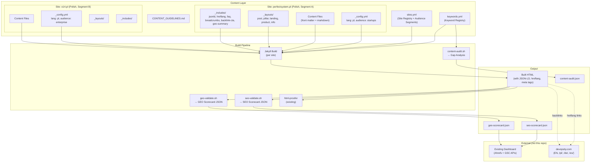
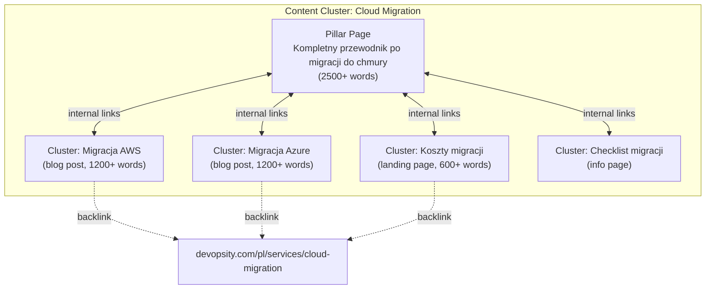

# Design Document: SEO & GEO Content Strategy System

## Overview

This design describes a Jekyll-based content strategy system that adds SEO and GEO (Generative Engine Optimization) capabilities to the existing multi-site repository (perfectsystem.pl, o14.pl, and future domains). The system provides:

- Content architecture with topic clusters (pillar + cluster pages) and audience-segment differentiation per satellite site
- Jekyll layouts, includes, and front matter schemas for blog posts, pillar pages, landing pages, product pages, and informational pages
- JSON-LD structured data templates (Article, WebPage, Organization, BreadcrumbList, FAQPage, DefinedTerm)
- GEO-optimized content structure: summary paragraphs, hierarchical headings, FAQ sections, entity definitions, citation formatting
- Risk-aware backlink placement with varied anchor text, contextual editorial flow, and 40-80% ratio guardrails
- Simplified single-language satellite sites with cross-domain hreflang linking to devopsity.com language variants
- YAML keyword registry with audience segment scoping
- Build-time SEO and GEO validation scripts outputting JSON scorecards consumable by the existing external dashboard
- Content audit tooling for gap analysis against the keyword registry
- Integration with the existing CI/CD pipeline (from netlify-style-pipeline spec) as additional quality gate steps

The system does NOT build a standalone dashboard — scorecards output JSON consumed by the user's existing Ahrefs/GSC dashboard. External API integrations (Ahrefs, Google Search Console) are handled by the dashboard, not this repo.

### Key Design Decisions

1. **Audience segment per site, not per page** — Each satellite site targets one audience segment (configured in `_config.yml` and `sites.yml`). This keeps each site's identity genuinely distinct and avoids PBN-like patterns where sites look like clones.

2. **Single language per satellite site** — Polish satellites are Polish-only, future English satellites are English-only. No `/en/` `/pl/` subdirectories on satellites. Cross-domain hreflang tags point to devopsity.com's language variants only.

3. **Risk-aware backlink strategy** — Links must feel natural and editorial. Varied anchor text (no phrase repeated >2 times per site), contextual placement within body content only (not sidebars/footers), 40-80% ratio cap. The system is explicitly designed to avoid PBN detection patterns.

4. **Build-time scorecards as JSON** — Validation scripts double as scorecard generators. `seo-validate.sh` outputs the SEO scorecard JSON, `geo-validate.sh` outputs the GEO scorecard JSON. No separate scorecard generation step needed.

5. **Shared includes, per-site layouts** — Jekyll `_includes` for JSON-LD, hreflang, FAQ, breadcrumbs, and backlink CTA live in each site's `_includes/` directory (copied from shared templates). Layouts are per-site to allow audience-specific customization.

6. **Keyword registry as simple YAML** — `keywords.yml` at repo root. No UI, no database. Validation scripts cross-reference it during build.

7. **Integration with existing CI/CD** — SEO/GEO validation scripts plug into the existing `pr-pipeline.yml` and `production-pipeline.yml` as additional steps in the build-and-validate matrix job, after html-proofer checks.

## Architecture



### Content Cluster Architecture



## Components and Interfaces

### 1. Site Registry Extension (`sites.yml`)

The existing `sites.yml` is extended with `audience_segment` and `lang` fields:

```yaml
sites:
  - id: blog
    source_dir: sites/blog
    domain: perfectsystem.pl
    lang: pl
    audience_segment: startups
    preview_bucket: perfectsystem-blog-preview
    production_bucket: perfectsystem-blog-prod
    cloudfront_distribution_id: E1ABC2DEF3GH4I
    terragrunt_env: blog

  - id: o14
    source_dir: sites/o14
    domain: o14.pl
    lang: pl
    audience_segment: enterprise
    preview_bucket: o14-preview
    production_bucket: o14-prod
    cloudfront_distribution_id: EXXXXXXXXXX
    terragrunt_env: o14
```

### 2. Keyword Registry (`keywords.yml`)

A flat YAML file at the repo root mapping keywords to clusters, sites, and audience segments:

```yaml
keywords:
  - keyword: "migracja do chmury"
    cluster: cloud-migration
    site_id: blog
    language: pl
    audience_segment: startups
    search_intent: informational
    target_url: /migracja-do-chmury/
    status: published

  - keyword: "enterprise cloud migration strategy"
    cluster: cloud-migration
    site_id: o14
    language: pl
    audience_segment: enterprise
    search_intent: commercial
    status: planned
```

### 3. Jekyll Layouts (per site)

Each site gets these layout files in `_layouts/`:

| Layout | Content Type | Key Features |
|--------|-------------|--------------|
| `post.html` | Blog posts | Article JSON-LD, backlink CTA, FAQ section, GEO summary |
| `pillar.html` | Pillar pages | Auto-generated cluster TOC, Article JSON-LD, FAQ section |
| `landing.html` | Landing pages | WebPage JSON-LD, backlink CTA, conversion-focused |
| `product.html` | Product/service pages | WebPage JSON-LD, service schema |
| `info.html` | Informational pages | WebPage JSON-LD, breadcrumbs |
| `default.html` | Base layout | HTML lang attribute, meta tags, hreflang, Organization JSON-LD (home only) |

All layouts extend `default.html` which handles:
- `<html lang="{{ site.lang }}">` attribute
- SEO meta tags via `jekyll-seo-tag`
- Canonical URL
- Open Graph and Twitter Card tags
- Hreflang tags (via `_includes/hreflang.html`)
- JSON-LD structured data (via `_includes/jsonld.html`)

### 4. Jekyll Includes (per site)

| Include | Purpose |
|---------|---------|
| `jsonld.html` | Renders JSON-LD based on page layout: Article for posts, WebPage for landing/product, Organization for home, BreadcrumbList for all non-home, FAQPage when `faq` front matter present, DefinedTerm when `definitions` present |
| `hreflang.html` | Renders hreflang link tags from `devopsity_translations` front matter field, plus self-referencing hreflang |
| `breadcrumbs.html` | Renders visible breadcrumb navigation + BreadcrumbList JSON-LD |
| `faq.html` | Renders FAQ section using `<details>`/`<summary>` elements from `faq` front matter array |
| `backlink-cta.html` | Renders contextual CTA block linking to devopsity.com with configurable text from `_config.yml` |
| `geo-summary.html` | Renders the GEO-optimized summary paragraph block after H1 |
| `cluster-toc.html` | Auto-generates table of contents for pillar pages by querying all pages in the same cluster |

### 5. Validation Scripts

| Script | Input | Output | Checks |
|--------|-------|--------|--------|
| `scripts/seo-validate.sh` | Built `_site/` directory | `seo-scorecard.json` | Title tag, meta description, canonical, OG tags, JSON-LD presence, JSON-LD syntax, internal link count |
| `scripts/geo-validate.sh` | Built `_site/` directory | `geo-scorecard.json` | Summary paragraph after H1, heading hierarchy (no skips), FAQ presence, word count minimums |
| `scripts/content-audit.sh` | `keywords.yml` + site content | `content-audit.json` + `content-audit.md` | Keyword coverage, content gaps, orphaned content, cannibalization |

### 6. CI/CD Integration

The validation scripts integrate into the existing pipeline as additional steps in the build-and-validate matrix job:

```yaml
# Added to pr-pipeline.yml and production-pipeline.yml
# After existing html-proofer steps:
- name: SEO Validation
  run: bash scripts/seo-validate.sh ./_site/
  # Outputs seo-scorecard.json

- name: GEO Validation
  run: bash scripts/geo-validate.sh ./_site/
  # Outputs geo-scorecard.json

- name: Content Audit
  run: bash scripts/content-audit.sh keywords.yml ${{ matrix.site.source_dir }}
  # Outputs content-audit.json
```

## Data Models

### Content Front Matter Schema (Blog Post)

```yaml
---
layout: post
title: "Jak przeprowadzić migrację do AWS — przewodnik dla startupów"
description: "Praktyczny przewodnik migracji do AWS dla startupów. Dowiedz się o kosztach, strategiach i najczęstszych błędach." # 120-160 chars
author: jan
date: 2024-01-15
last_modified: 2024-02-01
lang: pl
content_type: post
cluster: cloud-migration
keywords:
  - "migracja do AWS"
  - "AWS dla startupów"
image: /assets/images/aws-migration.jpg

# Backlink configuration
backlink_target: "https://devopsity.com/pl/services/cloud-migration"
backlink_anchor: "profesjonalna migracja do chmury"

# GEO fields
summary: "Migracja do AWS to proces przenoszenia infrastruktury IT do chmury Amazon Web Services. Dla startupów kluczowe są koszty, szybkość wdrożenia i skalowalność."
faq:
  - q: "Ile kosztuje migracja do AWS?"
    a: "Koszt migracji do AWS zależy od rozmiaru infrastruktury. Dla startupów typowy koszt to 5000-20000 PLN."
  - q: "Jak długo trwa migracja do AWS?"
    a: "Typowa migracja dla startupu trwa 2-8 tygodni, w zależności od złożoności."
definitions:
  - term: "Lift and Shift"
    definition: "Strategia migracji polegająca na przeniesieniu aplikacji do chmury bez zmian w architekturze."
sources:
  - url: "https://aws.amazon.com/cloud-migration/"
    title: "AWS Cloud Migration"
  - url: "https://www.gartner.com/en/information-technology/glossary/cloud-migration"
    title: "Gartner Cloud Migration Definition"

# Cross-domain hreflang (to devopsity.com variants)
devopsity_translations:
  en: "https://devopsity.com/aws-migration-guide/"
  pl: "https://devopsity.com/pl/przewodnik-migracja-aws/"

# SEO overrides (optional)
noindex: false
permalink: # optional override
---
```

### Content Front Matter Schema (Pillar Page)

```yaml
---
layout: pillar
title: "Kompletny przewodnik po migracji do chmury"
description: "Wszystko co musisz wiedzieć o migracji do chmury — strategie, koszty, narzędzia i najlepsze praktyki dla startupów."
author: jan
date: 2024-01-01
last_modified: 2024-03-01
lang: pl
content_type: pillar
cluster: cloud-migration
keywords:
  - "migracja do chmury"
  - "cloud migration"
image: /assets/images/cloud-migration-pillar.jpg
summary: "Migracja do chmury to strategiczny proces przenoszenia danych, aplikacji i infrastruktury IT do środowiska chmurowego."
faq:
  - q: "Co to jest migracja do chmury?"
    a: "Migracja do chmury to proces przenoszenia zasobów IT z infrastruktury on-premise do usług chmurowych."
devopsity_translations:
  en: "https://devopsity.com/cloud-migration-guide/"
  pl: "https://devopsity.com/pl/przewodnik-migracja-chmura/"
---
```

### Content Front Matter Schema (Landing Page)

```yaml
---
layout: landing
title: "Migracja do chmury dla Twojego startupu"
description: "Profesjonalna migracja do chmury AWS, Azure i GCP. Bezpłatna konsultacja dla startupów."
lang: pl
content_type: landing
cluster: cloud-migration
keywords:
  - "migracja do chmury startup"
image: /assets/images/landing-cloud.jpg
summary: "Oferujemy profesjonalną migrację do chmury dla startupów — szybko, bezpiecznie i w budżecie."
backlink_target: "https://devopsity.com/pl/contact/"
backlink_anchor: "umów bezpłatną konsultację"
---
```

### Site Config Extension (`_config.yml`)

```yaml
# Existing fields...
name: "PerfectSystem"
title: "PerfectSystem — Cloud dla Startupów"
description: "Blog o chmurze, DevOps i migracji IT dla startupów"
url: "https://perfectsystem.pl"
lang: pl
audience_segment: startups

# SEO configuration
author:
  name: "Jan Kowalski"
  twitter: "perfectsystem_pl"
twitter:
  username: "perfectsystem_pl"
  card: summary_large_image
facebook:
  publisher: "https://facebook.com/perfectsystem"
logo: /assets/images/logo.png
social:
  links:
    - "https://twitter.com/perfectsystem_pl"
    - "https://linkedin.com/company/perfectsystem"

# Tracking (GSC verification only — analytics handled externally)
tracking:
  google_site_verification: "abc123def456"

# Backlink CTA defaults
backlink_cta:
  text: "Potrzebujesz pomocy z migracją? Sprawdź ofertę Devopsity →"
  url: "https://devopsity.com/pl/services/"

# Main sales page (for backlink validation)
main_sales_page: "https://devopsity.com"

# Permalink patterns per content type
defaults:
  - scope:
      type: "posts"
    values:
      layout: post
      content_type: post
      permalink: "/:categories/:title/"
  - scope:
      path: "_landing"
    values:
      layout: landing
      content_type: landing
      permalink: "/:title/"
  - scope:
      path: "_products"
    values:
      layout: product
      content_type: product
      permalink: "/services/:title/"
  - scope:
      path: "_info"
    values:
      layout: info
      content_type: info
      permalink: "/info/:title/"

# Collections for non-post content types
collections:
  landing:
    output: true
  products:
    output: true
  info:
    output: true
  pillars:
    output: true

# Plugins
plugins:
  - jekyll-seo-tag
  - jekyll-sitemap
  - jekyll-feed
  - jekyll-paginate
```

### SEO Scorecard JSON Schema

```json
{
  "site_id": "blog",
  "build_timestamp": "2024-01-15T10:30:00Z",
  "pages": [
    {
      "url": "/migracja-do-aws/",
      "checks": {
        "title_present": true,
        "title_length": { "pass": true, "value": 52 },
        "meta_description_present": true,
        "meta_description_length": { "pass": true, "value": 145 },
        "canonical_present": true,
        "og_tags_present": true,
        "twitter_tags_present": true,
        "jsonld_present": true,
        "jsonld_valid": true,
        "internal_links_count": { "pass": true, "value": 5 },
        "keyword_in_registry": true
      },
      "score": 100,
      "warnings": []
    }
  ],
  "summary": {
    "total_pages": 15,
    "pages_passing": 12,
    "pages_warning": 3,
    "average_score": 87.5
  }
}
```

### GEO Scorecard JSON Schema

```json
{
  "site_id": "blog",
  "build_timestamp": "2024-01-15T10:30:00Z",
  "pages": [
    {
      "url": "/migracja-do-aws/",
      "geo_checks": {
        "summary_paragraph": true,
        "heading_hierarchy": true,
        "faq_present": true,
        "definitions_present": false,
        "sources_present": true,
        "word_count": { "pass": true, "value": 1450 }
      },
      "geo_score": 83,
      "warnings": ["No definitions section found"]
    }
  ],
  "summary": {
    "total_pages": 15,
    "pages_passing": 10,
    "pages_needing_optimization": 5,
    "average_geo_score": 74.2
  }
}
```

### Content Audit JSON Schema

```json
{
  "site_id": "blog",
  "audit_timestamp": "2024-01-15T10:30:00Z",
  "clusters": {
    "cloud-migration": {
      "published": 5,
      "in_progress": 2,
      "planned": 3,
      "coverage_percent": 50
    }
  },
  "gaps": [
    { "keyword": "enterprise cloud migration", "cluster": "cloud-migration", "status": "planned" }
  ],
  "orphaned": [
    { "url": "/old-post-without-keyword/", "title": "Some Old Post" }
  ],
  "cannibalization": [
    { "keyword": "migracja AWS", "pages": ["/migracja-aws/", "/aws-migration-guide/"] }
  ]
}
```

### Keyword Registry Schema (`keywords.yml`)

```yaml
keywords:
  - keyword: string          # Target keyword phrase
    cluster: string          # Content cluster ID (kebab-case)
    site_id: string          # Site ID from sites.yml
    language: string         # ISO 639-1 language code
    audience_segment: string # Must match site's audience_segment
    search_intent: enum      # informational | navigational | transactional | commercial
    target_url: string       # URL path if published (optional)
    status: enum             # planned | in-progress | published
```

### JSON-LD Templates

**Article (blog posts, pillar pages):**
```json
{
  "@context": "https://schema.org",
  "@type": "Article",
  "headline": "{{ page.title }}",
  "author": {
    "@type": "Person",
    "name": "{{ author.name }}"
  },
  "datePublished": "{{ page.date | date_to_xmlschema }}",
  "dateModified": "{{ page.last_modified | default: page.date | date_to_xmlschema }}",
  "publisher": {
    "@type": "Organization",
    "name": "{{ site.title }}",
    "logo": {
      "@type": "ImageObject",
      "url": "{{ site.url }}{{ site.logo }}"
    }
  },
  "description": "{{ page.description }}",
  "mainEntityOfPage": {
    "@type": "WebPage",
    "@id": "{{ site.url }}{{ page.url }}"
  },
  "image": "{{ site.url }}{{ page.image }}"
}
```

**FAQPage (when `faq` front matter present):**
```json
{
  "@context": "https://schema.org",
  "@type": "FAQPage",
  "mainEntity": [
    {
      "@type": "Question",
      "name": "{{ faq_item.q }}",
      "acceptedAnswer": {
        "@type": "Answer",
        "text": "{{ faq_item.a }}"
      }
    }
  ]
}
```

**BreadcrumbList (all non-home pages):**
```json
{
  "@context": "https://schema.org",
  "@type": "BreadcrumbList",
  "itemListElement": [
    {
      "@type": "ListItem",
      "position": 1,
      "name": "Home",
      "item": "{{ site.url }}/"
    },
    {
      "@type": "ListItem",
      "position": 2,
      "name": "{{ page.categories[0] | default: page.content_type }}",
      "item": "{{ site.url }}/{{ page.categories[0] | default: page.content_type }}/"
    },
    {
      "@type": "ListItem",
      "position": 3,
      "name": "{{ page.title }}"
    }
  ]
}
```

**Organization (home page only):**
```json
{
  "@context": "https://schema.org",
  "@type": "Organization",
  "name": "{{ site.title }}",
  "url": "{{ site.url }}",
  "logo": "{{ site.url }}{{ site.logo }}",
  "sameAs": {{ site.social.links | jsonify }},
  "contactPoint": {
    "@type": "ContactPoint",
    "contactType": "customer service",
    "url": "{{ site.backlink_cta.url }}"
  }
}
```

**DefinedTerm (when `definitions` front matter present):**
```json
{
  "@context": "https://schema.org",
  "@type": "DefinedTerm",
  "name": "{{ def.term }}",
  "description": "{{ def.definition }}"
}
```

### Backlink Placement Patterns (Google-Safe)

The backlink strategy is designed to avoid PBN detection patterns:

**Pattern 1: In-content editorial link**
A natural mention within a paragraph that discusses the topic. The link appears where a reader would expect a reference to a service provider.

```html
<p>Przy planowaniu migracji warto rozważyć współpracę z doświadczonym partnerem.
<a href="https://devopsity.com/pl/services/cloud-migration">Zespół Devopsity specjalizuje się
w migracjach do chmury</a> i może pomóc w uniknięciu typowych błędów.</p>
```

**Pattern 2: End-of-article CTA block**
A styled but non-intrusive call-to-action at the end of the article, rendered by `_includes/backlink-cta.html`:

```html
<aside class="cta-block" role="complementary">
  <p>{{ site.backlink_cta.text }}</p>
  <a href="{{ site.backlink_cta.url }}" class="cta-link">{{ site.backlink_cta.text }}</a>
</aside>
```

**Anti-PBN safeguards enforced by validation:**
- Anchor text variety: no single phrase used on >2 pages per site
- Placement: only within `<article>` or `<main>` content, never in `<aside>`, `<footer>`, or `<nav>` boilerplate
- Ratio: 40-80% of pages with backlinks (not 100%)
- Each site has genuinely different content, audience segment, and editorial voice
- Links are `dofollow` (default) — no `rel="sponsored"` or `rel="nofollow"` which would negate the SEO value

### Repository Directory Structure (SEO/GEO additions)

```
/
├── keywords.yml                        # Keyword Registry
├── CONTENT_GUIDELINES.md               # Editorial guidelines
├── sites.yml                           # Extended with audience_segment, lang
├── sites/
│   ├── blog/                           # perfectsystem.pl (Polish, startups)
│   │   ├── _config.yml                 # Extended with SEO/GEO config
│   │   ├── _layouts/
│   │   │   ├── default.html            # Base: lang, meta, hreflang, jsonld
│   │   │   ├── post.html               # Blog posts
│   │   │   ├── pillar.html             # Pillar pages (auto cluster TOC)
│   │   │   ├── landing.html            # Landing pages
│   │   │   ├── product.html            # Product/service pages
│   │   │   └── info.html               # Informational pages
│   │   ├── _includes/
│   │   │   ├── jsonld.html             # JSON-LD structured data
│   │   │   ├── hreflang.html           # Cross-domain hreflang tags
│   │   │   ├── breadcrumbs.html        # Breadcrumb nav + JSON-LD
│   │   │   ├── faq.html                # FAQ section rendering
│   │   │   ├── backlink-cta.html       # Backlink CTA block
│   │   │   ├── geo-summary.html        # GEO summary paragraph
│   │   │   └── cluster-toc.html        # Pillar page cluster TOC
│   │   ├── _posts/                     # Blog posts
│   │   ├── _pillars/                   # Pillar pages collection
│   │   ├── _landing/                   # Landing pages collection
│   │   ├── _products/                  # Product pages collection
│   │   ├── _info/                      # Informational pages collection
│   │   └── ...
│   └── o14/                            # o14.pl (Polish, enterprise)
│       ├── _config.yml
│       ├── _layouts/                   # Same structure, different styling/voice
│       ├── _includes/                  # Same includes
│       └── ...
├── scripts/
│   ├── pipeline-utils.sh               # Existing CI/CD utilities
│   ├── seo-validate.sh                 # SEO validation → scorecard JSON
│   ├── geo-validate.sh                 # GEO validation → scorecard JSON
│   └── content-audit.sh                # Content audit → gap analysis
└── .github/workflows/                  # Extended with SEO/GEO steps
```


## Correctness Properties

*A property is a characteristic or behavior that should hold true across all valid executions of a system — essentially, a formal statement about what the system should do. Properties serve as the bridge between human-readable specifications and machine-verifiable correctness guarantees.*

The SEO/GEO content strategy system contains several pieces of custom validation logic suitable for property-based testing: front matter validators, keyword registry validators, scorecard calculators, backlink ratio/anchor-text checkers, heading hierarchy validators, and content audit logic. These are pure functions that take structured input (YAML front matter, HTML content, keyword registry data) and produce structured output (pass/fail, scores, warnings). The Jekyll template rendering itself is tested via example-based integration tests (build and inspect output).

### Property 1: Front matter required fields validation

*For any* content front matter YAML and *any* combination of present/missing required fields (title, description, layout, lang, content_type, cluster, keywords, author, date), the front matter validator SHALL report exactly the set of missing required fields and pass only when all required fields are present.

**Validates: Requirements 1.2, 4.6**

### Property 2: Cluster reference validation

*For any* content front matter referencing a cluster name and *any* keyword registry, the cluster validator SHALL report an error if and only if the referenced cluster does not exist in the keyword registry.

**Validates: Requirements 1.5**

### Property 3: Pillar page cluster TOC completeness

*For any* content cluster with one pillar page and N cluster pages, the generated pillar page TOC SHALL contain exactly N links, one to each cluster page in the cluster.

**Validates: Requirements 1.4**

### Property 4: Duplicate audience segment detection

*For any* sites.yml registry with N site entries, the audience segment validator SHALL report a warning if and only if two or more sites share the same `audience_segment` value.

**Validates: Requirements 2.5**

### Property 5: URL collision detection

*For any* set of pages on the same site, the URL validator SHALL report a collision error if and only if two or more pages resolve to the same URL path.

**Validates: Requirements 3.4**

### Property 6: SEO metadata length validation

*For any* page title string and *any* meta description string, the SEO validator SHALL flag the title if its rendered length (title + separator + site name) is outside 30-60 characters, and flag the description if its length is outside 120-160 characters.

**Validates: Requirements 4.1, 4.2**

### Property 7: JSON-LD syntax validation

*For any* string embedded in a `<script type="application/ld+json">` block, the JSON-LD validator SHALL report an error if and only if the string is not valid JSON.

**Validates: Requirements 5.6**

### Property 8: FAQ rendering round-trip

*For any* list of FAQ entries (question-answer pairs) in front matter, the rendered HTML SHALL contain a `<details>`/`<summary>` block for each entry AND the JSON-LD FAQPage schema SHALL contain a Question/Answer pair for each entry, with matching text content.

**Validates: Requirements 5.5, 7.4**

### Property 9: Heading hierarchy validation

*For any* HTML content with heading elements (H1-H6), the heading hierarchy validator SHALL report a warning if and only if a heading level is skipped (e.g., H1 followed directly by H3 without an intervening H2).

**Validates: Requirements 7.2**

### Property 10: Definitions rendering

*For any* list of term-definition pairs in front matter, the rendered HTML SHALL contain a `<dfn>` element for each term AND the JSON-LD output SHALL contain a DefinedTerm schema entry for each term with matching name and description.

**Validates: Requirements 7.3**

### Property 11: Backlink validation (anchor variety, ratio, placement)

*For any* set of pages on a satellite site with more than 5 published cluster pages:
- The anchor text validator SHALL flag a warning if any single anchor text phrase appears on more than 2 pages.
- The ratio validator SHALL flag a warning if the percentage of pages with backlinks is outside 40-80%.
- The placement validator SHALL flag a warning if any backlink appears outside `<article>` or `<main>` elements (i.e., in `<aside>`, `<footer>`, or `<nav>`).

**Validates: Requirements 8.5, 8.6, 8.7, 8.8**

### Property 12: Backlink target and anchor rendering

*For any* content front matter with a `backlink_target` URL and `backlink_anchor` text, the rendered HTML SHALL contain an `<a>` element whose `href` matches the `backlink_target` and whose text content matches the `backlink_anchor`.

**Validates: Requirements 8.2**

### Property 13: Hreflang rendering from devopsity_translations

*For any* content front matter with a `devopsity_translations` map of N language-URL pairs, the rendered HTML SHALL contain exactly N+1 hreflang `<link>` elements: one self-referencing hreflang for the current page's language, and one for each language variant pointing to the specified devopsity.com URL.

**Validates: Requirements 9.3, 9.4**

### Property 14: Keyword registry cross-reference validation

*For any* content front matter referencing a keyword and *any* keyword registry, the cross-reference validator SHALL report an error if the keyword does not exist in the registry OR if the content's `site_id`, `language`, or `audience_segment` does not match the registry entry for that keyword.

**Validates: Requirements 10.2**

### Property 15: Keyword cannibalization detection

*For any* set of content pages on the same satellite site, the cannibalization detector SHALL report a warning if and only if two or more pages target the same primary keyword.

**Validates: Requirements 10.4**

### Property 16: Content gap detection

*For any* keyword registry, the gap detector SHALL identify an entry as a content gap if and only if its `status` is "planned" and its `target_url` is empty or absent.

**Validates: Requirements 10.5**

### Property 17: Scorecard scoring correctness

*For any* set of check results (each being pass or fail) and *any* threshold percentage T, the scorecard scorer SHALL compute the score as (passed_checks / total_checks × 100) and flag the page as requiring attention if and only if the score is below T.

**Validates: Requirements 11.3, 12.2**

### Property 18: Scorecard JSON schema compliance

*For any* scorecard output (SEO or GEO), the JSON SHALL contain the fields `site_id` (string), `build_timestamp` (ISO 8601 string), `pages` (array of objects each with `url` and `score`/`geo_score`), and `summary` (object with `total_pages` and aggregate counts).

**Validates: Requirements 11.4, 12.3**

### Property 19: SEO/GEO validation element detection

*For any* HTML page with a known set of present/absent SEO elements (title, meta description, canonical, OG tags, JSON-LD) and GEO elements (summary paragraph, heading hierarchy, FAQ, word count), the validation scripts SHALL correctly identify exactly which elements are present and which are absent.

**Validates: Requirements 15.1, 15.2**

### Property 20: Word count validation

*For any* content page with a known word count and content type, the word count validator SHALL flag a warning if and only if the word count is below the minimum for that content type (blog post: 1200, pillar page: 2500, landing page: 600).

**Validates: Requirements 13.5**

### Property 21: Content audit coverage calculation

*For any* keyword registry and *any* set of published content, the audit script SHALL correctly count published, in-progress, and planned entries per cluster, and compute coverage percentage as (published / total × 100) per cluster.

**Validates: Requirements 16.1, 16.2**

### Property 22: Orphaned content detection

*For any* set of published pages and *any* keyword registry, the orphan detector SHALL identify a page as orphaned if and only if its target keyword does not appear in the keyword registry.

**Validates: Requirements 16.3**

## Error Handling

### Build-Time Validation Errors

| Error | Cause | Handling |
|-------|-------|----------|
| Missing required front matter field | Content author omitted title, description, cluster, etc. | `seo-validate.sh` reports error in JSON output, page flagged in scorecard, pipeline fails if field is required |
| Undefined cluster reference | Content references a cluster not in `keywords.yml` | Validation error in scorecard, pipeline fails |
| URL collision | Two pages generate the same URL path | Validation error, pipeline fails, both pages identified |
| Invalid JSON-LD syntax | Liquid template error producing malformed JSON | `seo-validate.sh` reports JSON-LD validation error, pipeline fails |
| Keyword cannibalization | Two pages on same site target same keyword | Warning in content audit report (non-blocking) |
| Duplicate audience segment | Two sites in `sites.yml` share same segment | Warning (non-blocking) — may be intentional for future sites |

### Scorecard Warnings (Non-Blocking)

| Warning | Cause | Handling |
|---------|-------|----------|
| SEO score below 80% | Page missing optional SEO elements | Flagged in `seo-scorecard.json`, does not block deployment |
| GEO score below 70% | Page missing GEO elements (FAQ, summary, etc.) | Flagged in `geo-scorecard.json`, does not block deployment |
| Word count below minimum | Content too short for its type | Warning in GEO scorecard |
| Missing backlink on cluster page | Cluster page has no link to devopsity.com | Warning in SEO scorecard |
| Anchor text repetition | Same anchor text on >2 pages | Warning in SEO scorecard |
| Backlink ratio outside 40-80% | Too many or too few pages with backlinks | Warning in SEO scorecard |
| Content gap | Planned keyword with no published content | Listed in content audit report |
| Orphaned content | Published page not in keyword registry | Listed in content audit report |

### Script Failure Handling

| Error | Cause | Handling |
|-------|-------|----------|
| `seo-validate.sh` crashes | Script error, missing dependencies (`jq`, `grep`) | Pipeline step fails, error logged. Other sites in matrix unaffected (`fail-fast: false`). |
| `geo-validate.sh` crashes | Same | Same handling |
| `keywords.yml` not found | File missing or renamed | Validation scripts exit with error, pipeline fails |
| `keywords.yml` invalid YAML | Syntax error in YAML | `yq` parse error, script exits non-zero, pipeline fails |
| Unreachable translation URL | devopsity.com page doesn't exist yet | Warning only (non-blocking) — translations may be planned |

### Severity Levels

The system uses two severity levels for validation results:

1. **Error (blocking)**: Missing required SEO fields, invalid JSON-LD, undefined cluster references, URL collisions. These prevent deployment.
2. **Warning (non-blocking)**: Low scores, missing optional GEO elements, backlink issues, content gaps, cannibalization. These are reported in scorecards but do not block deployment.

## Testing Strategy

### Property-Based Testing Configuration

The validation scripts are shell scripts using `grep`, `jq`, and `yq`. Property-based tests will use `hypothesis` (Python) to generate random inputs and verify the shell script outputs, or alternatively use a shell-based test harness with generated inputs.

- **Library**: `hypothesis` (Python) for generating random HTML, YAML, and JSON inputs; shell scripts invoked via `subprocess`
- **Minimum iterations**: 100 per property test
- **Tag format**: `Feature: seo-geo-content-strategy, Property {N}: {description}`

| Property | Test Description | Validates |
|----------|-----------------|-----------|
| Property 1 | Generate random front matter with missing fields, verify validator output | Req 1.2, 4.6 |
| Property 2 | Generate random cluster names vs keyword registry, verify error detection | Req 1.5 |
| Property 3 | Generate random clusters with N pages, verify TOC has N links | Req 1.4 |
| Property 4 | Generate random sites.yml with duplicate/unique segments, verify detection | Req 2.5 |
| Property 5 | Generate random page sets with colliding/unique URLs, verify detection | Req 3.4 |
| Property 6 | Generate random title/description strings, verify length flagging | Req 4.1, 4.2 |
| Property 7 | Generate random JSON strings (valid/invalid), verify syntax detection | Req 5.6 |
| Property 8 | Generate random FAQ lists, verify HTML and JSON-LD output match | Req 5.5, 7.4 |
| Property 9 | Generate random heading sequences, verify skip detection | Req 7.2 |
| Property 10 | Generate random definition lists, verify dfn and JSON-LD output | Req 7.3 |
| Property 11 | Generate random page sets with backlinks, verify anchor/ratio/placement checks | Req 8.5, 8.6, 8.7, 8.8 |
| Property 12 | Generate random backlink_target/anchor, verify rendered HTML | Req 8.2 |
| Property 13 | Generate random devopsity_translations maps, verify hreflang output | Req 9.3, 9.4 |
| Property 14 | Generate random content + keyword registry, verify cross-reference checks | Req 10.2 |
| Property 15 | Generate random page sets with keyword assignments, verify cannibalization | Req 10.4 |
| Property 16 | Generate random keyword entries, verify gap detection | Req 10.5 |
| Property 17 | Generate random check results + thresholds, verify score calculation | Req 11.3, 12.2 |
| Property 18 | Generate random scorecard outputs, verify JSON schema | Req 11.4, 12.3 |
| Property 19 | Generate random HTML with known elements, verify detection accuracy | Req 15.1, 15.2 |
| Property 20 | Generate random content with known word counts, verify threshold flagging | Req 13.5 |
| Property 21 | Generate random keyword registries + content, verify coverage calculation | Req 16.1, 16.2 |
| Property 22 | Generate random pages + registry, verify orphan detection | Req 16.3 |

### Unit Tests (Example-Based)

| Test | Validates |
|------|-----------|
| Blog post layout renders Article JSON-LD with all required properties | Req 5.1 |
| Landing page layout renders WebPage JSON-LD | Req 5.2 |
| Home page renders Organization JSON-LD | Req 5.3 |
| Non-home page renders BreadcrumbList JSON-LD | Req 5.4 |
| Page with `noindex: true` excluded from sitemap and has noindex meta | Req 6.3 |
| Sitemap excludes pagination and archive pages | Req 6.4 |
| Blog post renders backlink CTA block at end | Req 8.3 |
| `<html>` tag has correct `lang` attribute from site config | Req 9.2 |
| Content audit outputs both JSON and Markdown formats | Req 16.4 |
| Keyword registry accepts multiple keywords per cluster | Req 10.3 |

### Integration Tests

| Test | Validates |
|------|-----------|
| Full Jekyll build of blog site produces valid HTML with all SEO meta tags | Req 4.1-4.5 |
| `seo-validate.sh` runs against built site and produces valid JSON scorecard | Req 15.1, 15.4 |
| `geo-validate.sh` runs against built site and produces valid JSON scorecard | Req 15.2, 15.4 |
| `content-audit.sh` runs against keyword registry and produces reports | Req 16.1-16.4 |
| Pipeline executes SEO and GEO validation as distinct steps | Req 15.3 |
| Failing required SEO check causes pipeline failure | Req 15.5 |

### Smoke Tests

| Test | Validates |
|------|-----------|
| `_config.yml` contains `audience_segment` field | Req 2.1 |
| `sites.yml` contains `audience_segment` and `lang` for each site | Req 2.2 |
| `_config.yml` defines permalink patterns per content type | Req 3.1 |
| `_config.yml` includes required plugins | Req 14.1 |
| `_config.yml` has tracking section with GSC verification | Req 11.1 |
| Layout files exist for all content types | Req 13.1 |
| `CONTENT_GUIDELINES.md` exists | Req 13.4 |
| `keywords.yml` exists and is valid YAML | Req 10.1 |
